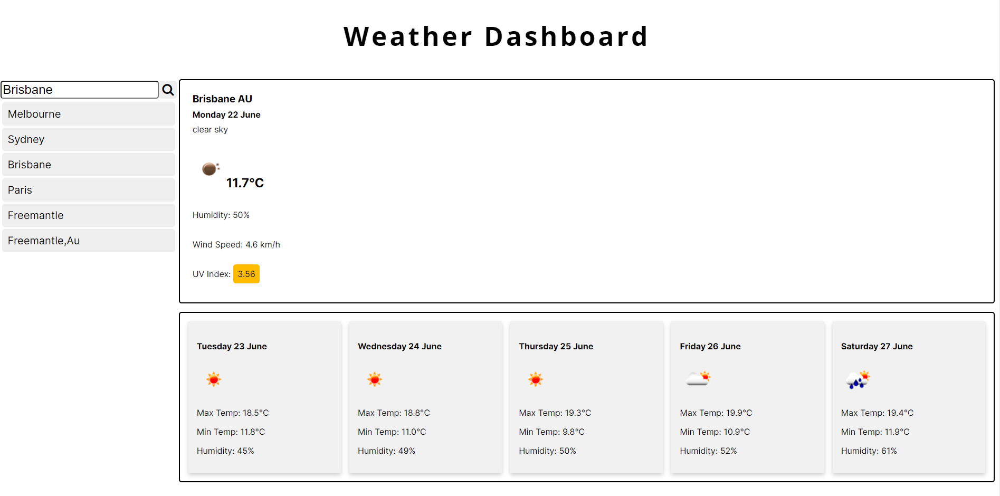

# weather-dashboard

A simple weather app that uses the [OpenWeather API](https://openweathermap.org/api) to retrieve weather data for cities.  
City searches are saved in `localStorage`.

# Goal
 To create a simple weather dashboard that allows the user to enter a city and get the current and 5 day forecast for that city. This app will runs in the browser and features dynamically updated HTML and CSS powered by jQuery.

# How to use
Type a city name in the search box where there are multiple cities with the same name you will need to specify the country code e.g "AU" Example format: "Sydney,Au"

# Deployed Project

https://ldipaola.github.io/weather-dashboard/